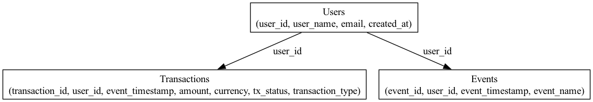

# BITSO DATA ENGINEERING TECHNICAL CHALLENGE
(Link to the project with all the data files: https://drive.google.com/drive/folders/14B81Y1IRTpobomxe6d--oiq8wWrFdlI2?usp=sharing)
# Challenge 1: Order Book Data Pipeline

## Overview

This project is designed to fetch order book data from the Bitso API for the `btc_mxn` and `usd_mxn` pairs every second, calculate the bid-ask spread, and store the data in a partitioned directory structure similar to S3. The data is stored in CSV files every 10 minutes, containing 600 records each. Additionally, the project includes alerting functionality whenever the spread exceeds specified thresholds.

## Project Structure

challenge1/<br>
├── README.md<br>
├── main.py<br>
├── order_book_pipeline/<br>
│ ├── init.py<br>
│ ├── config.py<br>
│ ├── data_fetcher.py<br>
│ ├── data_storage.py<br>
│ ├── spread_calculator.py<br>
│ └── utils.py<br>
└── tests/<br>
├── init.py<br>
└── test_order_book_pipeline.py<br>


## Partitioning Strategy

The directory structure for partitions is as follows:
- `year={year}`
- `month={month}`
- `day={day}`
- `hour={hour}`
- `minute={minute}`

### Justification for Partition Keys

The chosen partition keys are based on time attributes (year, month, day, hour, minute). This structure ensures that data is organized chronologically, which is critical for time-series data such as order book observations. It allows for efficient querying and retrieval of data for specific time periods, facilitating easy access for analysis and reporting.

Partitioning by time also helps manage the data size by breaking it into manageable chunks, ensuring that the files do not grow too large and remain easy to handle. This approach is commonly used in big data environments, especially in systems that deal with continuous data streams, such as financial markets.

## How to Run

### Prerequisites

1. **Python 3.x** installed.
2. Install the required libraries:
    ```bash
    pip install requests pandas
    ```

### Running the Main Script

1. Navigate to the `challenge1` directory:
    ```bash
    cd /path/to/challenge1
    ```
2. Run the main script:
    ```bash
    python main.py
    ```

### Running the Unit Tests

1. Navigate to the `challenge1` directory:
    ```bash
    cd /path/to/challenge1
    ```
2. Run the unit tests:
    ```bash
    python -m unittest discover tests
    ```

## Error Handling

The script includes error handling for HTTP requests and data processing steps to ensure robustness. Errors are logged, and the script continues to process subsequent data.

## Logging and Alerts

The script uses logging to provide information about its progress and to alert whenever the spread exceeds specified thresholds (1.0%, 0.5%, 0.1%). These alerts are logged as warnings.

## Code Style

The code follows PEP8 guidelines for readability and maintainability.

# Challenge 2: Data Model and ETL Pipeline

## Overview

This project provides an ETL pipeline to process and transform historical data for downstream users including Business Intelligence, Machine Learning, Experimentation, and Marketing. The data model and transformed tables enable these teams to answer various analytical questions.

## Data Model

The data model follows a **Star Schema** design, which is suitable for analytical queries and reporting.

### Fact Table
- **transactions**: Contains deposit and withdrawal transactions.

### Dimension Tables
- **users**: Contains user information.
- **events**: Contains user events (such as logins).

### Entity-Relationship Diagram (ERD)



## How to Run

### Prerequisites

1. **Python 3.x** installed.
2. Install the required libraries:
    ```bash
    pip install pandas
    ```

### Running the ETL Pipeline

1. Navigate to the `challenge2` directory:
    ```bash
    cd /path/to/bitso_de_technical_test/challenge2
    ```
2. Run the `main.py` script:
    ```bash
    python main.py
    ```
3. The transformed CSV files will be generated in the `output_tables` directory.

### Running the Unit Tests

1. Navigate to the `challenge2` directory:
    ```bash
    cd /path/to/bitso_de_technical_test/challenge2
    ```
2. Run the unit tests:
    ```bash
    python -m unittest discover tests
    ```

## ETL Pipeline

The ETL pipeline extracts data from the provided CSV files, transforms it, and loads it into new CSV files.

### Steps

1. Extract data from the CSV files.
2. Transform the data to meet the requirements.
3. Load the transformed data into new CSV files.

## Contact

For any questions or issues, please contact Emilio López at emilio.lopez@student.ie.edu
